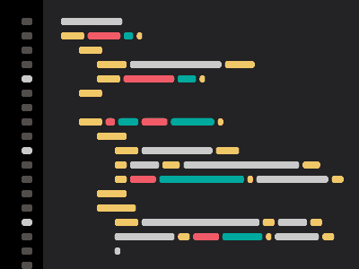

# Olá, sou o Douglas Mathias :wave:

`Desenvolvedor .Net` `Backend` `C#` `VB.Net` `SQL`

Desenvolvedor .Net com experiência em todas as etapas do ciclo de vida de software. Atuo principalmente em projetos em .Net utilizando as linguagens C# e VB\.Net.

---

### :brain:  Sobre mim

- :technologist: Desenvolvedor .Net com mais de 5 anos de experiência
- :lock: Formado em Segurança da Informação
- :saxophone: Músico nas horas vagas

### :rocket: Tech Stack

#### Projetos

- Integrações `APIs REST` e `WebServices SOAP`
- `Desktop WinForms`
- `Windows Services`
- `Scripts de Automação`
- `Análise de Sistemas`

#### Backend

- `C#` `.Net` `VB.Net` `ASP.Net`
- `Entity Framework`
- `APIs Rest` `WebServices SOAP`

#### Banco de Dados

- `Tabelas` `Procedures` `Triggers` `Jobs`
- `Query Tunning`
- `SQL Server`
- `Banco de Dados Relacionais`
- `Modelagem de Dados`

#### Frontend

- `HTML` `CSS` `JS`
- `Angular`
- `Razor Pages` `MVC`

#### Ferramentas

- `Git` `GitHub`
- `Visual Studio`
- `Clean Code`
- `SOLID`

### Contatos

[`Linkedin`](https://linkedin.com/in/douglas-mathias)
[`Portfolio`](https://douglas-mathias-dev.github.io/Portfolio/)